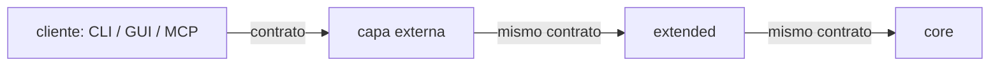

# Arquitectura de capas del ente

Estado: activo
Version: 1.0 - 2026-08-13

Como se COMPONEN las capas del ente. Complementa a `REGISTRO_CAPAS.md`, que dice
quien existe y quien depende de quien, y a `POLITICA_SEMVER.md`, que dice como se
versiona ese vinculo. Este documento dice que FORMA tiene la union.

Origen: meta ADR 0007.

## 1. El invariante

La regla que cualquier mecanismo de composicion tiene que cumplir:

> **Anadir una capa no obliga a editar ninguna capa existente, ni el cliente.**

Es el criterio de modularidad del ente. Un diseno que no lo cumple no es
modular: solo desplaza el acoplamiento a otro fichero.

Es un criterio FALSABLE. Ante cualquier propuesta de composicion, la pregunta es
literal: si manana entra una capa nueva, ¿que ficheros existentes hay que tocar?
Si la respuesta no es "ninguno", la propuesta no cumple.

## 2. El principio: contrato uniforme

Todas las capas hablan **el mismo contrato**. Cada capa lo implementa entero:
reenvia por defecto lo que no cambia y sobreescribe solo lo que enriquece. Un
cliente apunta a la capa mas externa y no necesita saber cuantas hay debajo.

Analogia: HTTP. Un proxy delante de una aplicacion habla HTTP, la aplicacion
habla HTTP, y el navegador no cambia porque se meta o se quite un salto
intermedio. Nadie anade comandos al navegador cuando pone una cache delante.

### Regla 1: contrato uniforme

Una capa que envuelve a otra expone el contrato COMPLETO de la envuelta. No un
subconjunto, no un catalogo propio distinto.

### Regla 2: reenvio por defecto, sobreescritura por excepcion

Lo que una capa no cambia, lo reenvia con un mecanismo GENERICO -uno, no uno por
capacidad-. Solo implementa a mano lo que de verdad transforma.

Consecuencia buscada: cuando la capa envuelta anade una capacidad nueva, esa
capacidad atraviesa las capas superiores sin que haya que tocarlas.

### Regla 3: extension aditiva

Una capa puede ANADIR capacidades propias al contrato. Nunca puede quitar ni
degradar las de abajo. Subir de capa siempre suma.

Los parametros de extension (por ejemplo, desactivar una fuente de
enriquecimiento) viajan como extension del contrato: quien no los entiende, los
ignora o los rechaza explicitamente, y nunca los interpreta a medias.

### Regla 4: los clientes son del contrato, no de las capas

Un cliente (CLI, GUI, MCP, script) se escribe contra el CONTRATO y apunta a un
extremo configurable. Cambiar la pila con la que trabaja es cambiar esa URL, no
editar el cliente.

Un cliente que contiene una rama por capa ("si extended esta instalado, ...")
viola el invariante: es la capa nueva obligando a editar codigo existente.

## 3. La direccion de la flecha no cambia

El contrato uniforme NO invierte el grafo de dependencias. Cada capa sigue
dependiendo solo de la de abajo, por SemVer (`REGISTRO_CAPAS.md`), y la capa
inferior sigue sin saber que existen las superiores.

En particular, esta doctrina es compatible con lo ya decidido y no lo reabre:

- `core ADR 0031` (enriquecimiento como costura propia) y su punto abierto sobre
  quien arma el prompt: lo arma la capa, como esta escrito.
- `core ADR 0035` (retirada de `MemoryPort`): sigue retirado; no hace falta.
- `core ADR 0040` (`task.plan` + `task.run` con plan): es justamente lo que
  permite que una capa implemente `task.run` enriquecido por subtarea sin que su
  cliente note nada. La reformulacion del core es el habilitador, no un estorbo.

## 4. Anti-patrones (lo que esta doctrina prohibe)

| Anti-patron | Por que falla el invariante |
|---|---|
| Catalogo reducido: la capa superior expone menos que la inferior | El cliente pierde capacidades al subir y acaba usando dos interfaces |
| Catalogo espejo escrito a mano | Cada capacidad nueva de abajo obliga a editar arriba |
| Cliente que conoce N capas | Cada capa nueva obliga a editar el cliente |
| Puerto de llamada hacia arriba | La capa inferior transporta conceptos de la superior; invierte el grafo |
| Despachador generico de verbos de terceros | El contrato publico pasa a ser "lo que declare quien este instalado": ilimitado e inversionable |

## 5. Frontera: lo que NO entra en el contrato uniforme

La ADMINISTRACION de una capa (mantenimiento, curacion, migraciones de su propio
almacen) no es una capacidad del ente: es operacion de un componente. Vive con su
componente y no tiene por que atravesar las capas superiores.

Matiz honesto: parte de esa administracion necesita acceso al sistema de ficheros
local de quien la ejecuta (ingerir un directorio de documentos, por ejemplo). Eso
justifica que una capa conserve un CLI de operador pequeno, aunque sus
capacidades tambien esten en el contrato.

## 6. Costes aceptados

No se ocultan:

- Cada capa sostiene el contrato de la de abajo. El reenvio generico lo abarata,
  pero no es gratis; el streaming a traves de un reenvio es trabajo real.
- Un salto de red mas por capa atravesada.
- La identidad del request y la traza deben propagarse intactas por cada salto,
  o la observabilidad del ente se rompe a la primera capa.

Se aceptan porque el coste alternativo -editar N repos cada vez que entra una
capa- crece con el cuadrado del ecosistema, y este crece.

## 7. Test de conformidad

Una capa o un cliente cumple esta doctrina si, al anadirse una capa nueva encima
o al anadir la capa de abajo una capacidad nueva:

1. no hay que editar ningun fichero de las capas existentes,
2. no hay que editar el cliente,
3. la capacidad nueva es alcanzable desde el extremo mas externo.
